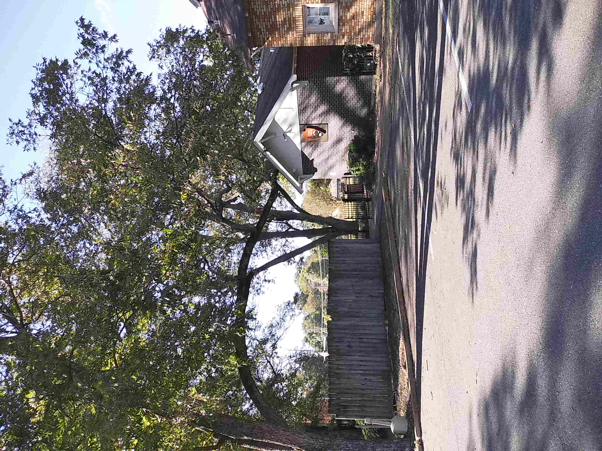
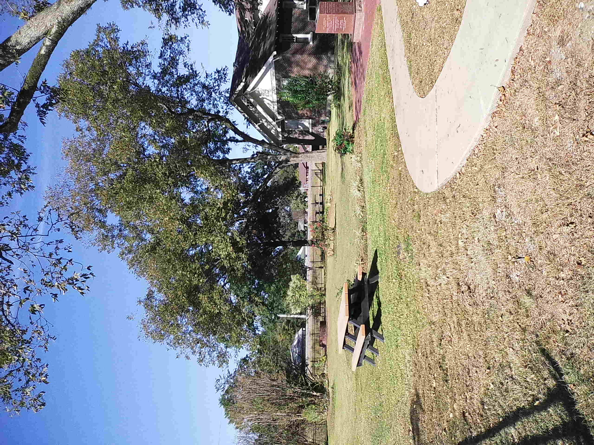
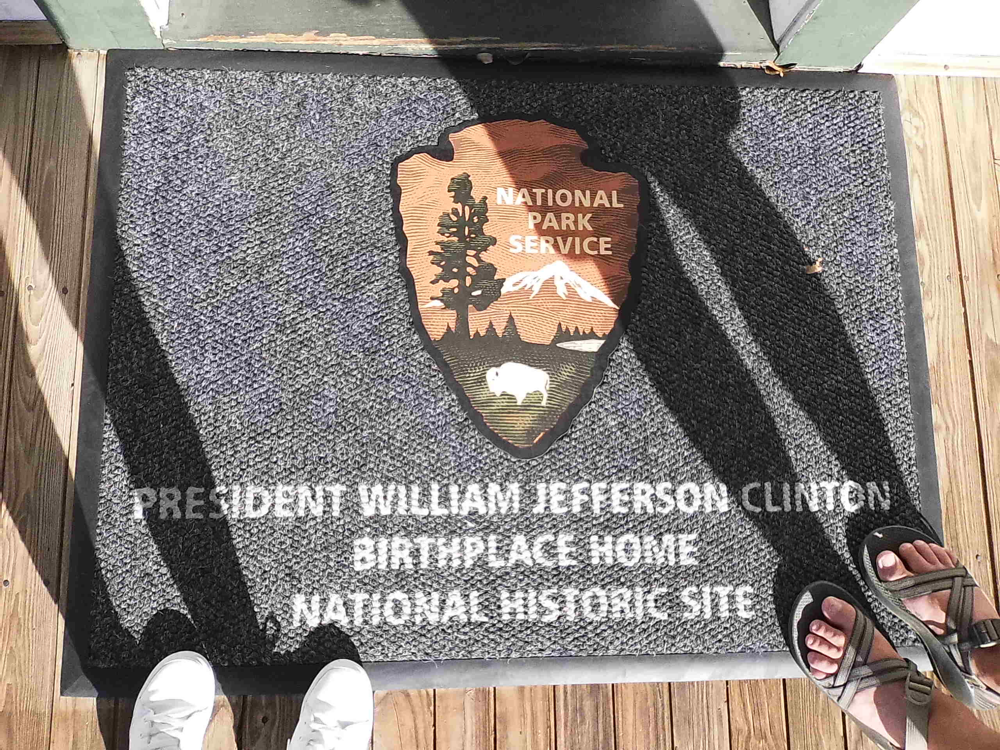

# Mini Trip 3: Completing Arkansas

Where we went:
- Hot Springs National Park : Arkansas
- President William Jefferson Clinton Birthplace Home National Historic Site : Arkansas

---
Like most of the trips we go on, we planned essentially nothing except for the destinations we wanted to go to. We knew we wanted to complete all of the National Park sites in Arkansas. The last two on our list were Hot Springs National Park and the President William Jefferson Clinton Birthplace Home National Historic Site. We currently have an EV which is great when you want to take a slow roadtip and enjoy the journey, but we had about a 6 hour trip to get to our furthest destination and one day to do it. So we decided to borrow a Bronco and pretend we had bronco money for the trip. I packed my blankie and snacks since Cayub always drives and we were off! 

## First stop: Hot Springs National Park
---
Our first destination was Hot Springs National Park! Hot springs is a city in Arkansas that is known for its hot springs, go figure... Finding free parking was a bit of a hassle, but we eventually found a free parking garage. There is plenty to do at the Hot Springs NP and surrounding area, from walking down the sidewalk and checking out the little stores to enjoying some of functioning bath/spa houses as well.

We made our way to the visitor center, housed in the impressive Fordyce Bathhouse. This three-story structure now serves as a museum, showcasing fascinating artifacts from its past. Exploring the exhibits offered a captivating glimpse into the history of the bathhouse and the people who once frequented it. Honestly, it kind of had an eerie vibe that reminded us of a haunted sanatorium; Cayub said it reminded him of the game Outlast!

If you have the time, I highly recommend wandering the trails and visiting the local shops. Don’t miss the Hot Springs Mountain Tower, an observation tower that provides stunning views and is surrounded by beautiful hiking trails.

## Second stop: President William Jefferson Clinton Birthplace Home National Historic Site
---
Our second stop was the President William Jefferson Clinton Birthplace Home National Historic Site. We made it to Hope, Arkansas and were not impressed. The site was beside an Atwoods and across the street from a Sonic Drive-In. If that doesn't scream Arkansas then I don't know what does.

The Birthplace Home itself was nice and reminded me of what I imagine every southern grandma's house looked like in the 1940s-1950s. However, the Visitor Center left much to be desired. It lacked both information and atmosphere, with only a few panels detailing Bill Clinton's life and a tiny gift shop to browse. We decided against watching the video about the house after the park ranger mentioned it primarily showcased the building itself.

Ultimately, we opted for a quick tour of the house before moving on, leaving us a bit disappointed that we had traveled so far for such a lackluster experience.

## The drive back home...
---

## Pics
Here are a few pictures of the Clinton Birthplace Home National Historic Site.

    

        
        
    

    

